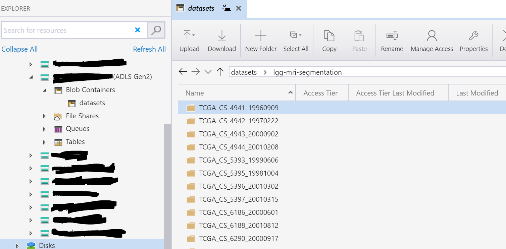

# unet-pytorch-azureml

An example for running UNET with PyTorch on Azure Machine Learning

Features:

* Train on Azure Machine Learning Compute
* Real-time scoring on ACI and AKS
* Support for multi-GPU instances 
* Azure DevOps training and deployment pipelines

# Instructions

1. Fork this repo
1. Create a new project in Azure DevOps and a Service Connection named `aml-demo`
1. Create a Azure Machine Learning workspace called `aml-demo` in a resource group named `aml-demo`
1. Download the [`lgg-mri-segmentation`](https://www.kaggle.com/mateuszbuda/lgg-mri-segmentation) dataset from Kaggle and put it into a Dataset in Azure Machine Learning, see folder structure:

1. Edit [`train.runconfig`](model/config/train.runconfig) and point it to the id of your newly registered dataset e.g., `id: c7e23b60-04c8-46dc-96c5-d9f741f6234b`
1. If you want to configure the resource names of the pipelines, edit [`pipelines/config.yml`](pipelines/config.yml)
1. Import and run infrastructure deployment pipeline from [`pipelines/deploy-infrastructure.yml`](pipelines/deploy-infrastructure.yml)
1. Import and run model training and registration pipeline from [`pipelines/train-and-register-model.yml`](pipelines/train-and-register-model.yml)
1. Import and run model deployment pipeline from [`pipelines/deploy-model.yml`](pipelines/deploy-model.yml)
1. Test your endpoints manually, e.g. using [VSCode Rest Client](https://marketplace.visualstudio.com/items?itemName=humao.rest-client)

```
POST https://<ACI Scoring URL> HTTP/1.1

< ./docs/test_image.png

#######

POST http://<AKS Scoring URL> HTTP/1.1
Authorization: Bearer <API Key>

< ./docs/test_image.png
```

# Credits

Credit for the original source code goes to [mateuszbuda/brain-segmentation-pytorch](https://github.com/mateuszbuda/brain-segmentation-pytorch).