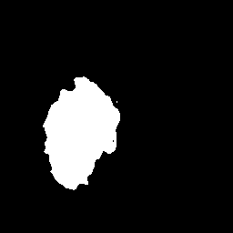

# unet-pytorch-azureml

An example for running a PyTorch-based UNET implementation on Azure Machine Learning.

| Input | Output |
| :---: |:---:|
|  |  |

:+1: Credit for the original source code goes to [mateuszbuda/brain-segmentation-pytorch](https://github.com/mateuszbuda/brain-segmentation-pytorch).

Features of this repo:

* Train a PyTorch UNET with [`lgg-mri-segmentation` dataset](https://www.kaggle.com/mateuszbuda/lgg-mri-segmentation) on Azure Machine Learning Compute
* Deploy model as real-time scoring API to ACI (CPU-based) and AKS (GPU-based)
* Support for multi-GPU instances (e.g., `NC12` or `NC24r`)
* Fully automated through Azure DevOps Pipelines for model training and deployment

# Instructions

1. Fork this repo
1. Create a new project in Azure DevOps and a Service Connection named `aml-demo`
1. Create a Azure Machine Learning workspace called `aml-demo` in a resource group named `aml-demo`
1. Download the [`lgg-mri-segmentation`](https://www.kaggle.com/mateuszbuda/lgg-mri-segmentation) dataset from Kaggle and put it into a Dataset in Azure Machine Learning, see folder structure:

1. Edit [`train-amlcompute.runconfig`](model/aml_config/train-amlcompute.runconfig) and point it to the id of your newly registered dataset e.g., `id: c7e23b60-04c8-46dc-96c5-d9f741f6234b` (use `az ml dataset list` to get the dataset's id)
1. If you want to configure the resource names of the pipelines, edit [`automation/config.yml`](automation/config.yml)
1. Import and run infrastructure deployment pipeline from [`automation/deploy-infrastructure.yml`](automation/deploy-infrastructure.yml)
1. Import and run model training and registration pipeline from [`automation/train-and-register-model.yml`](automation/train-and-register-model.yml)
1. Import and run model deployment pipeline from [`automation/deploy-model.yml`](automation/deploy-model.yml)
1. Test your endpoints manually, e.g. using [VSCode Rest Client](https://marketplace.visualstudio.com/items?itemName=humao.rest-client)

For running this repo's code locally, see the [`README.md`](model/README.md) in the `model` folder.

```
POST https://<ACI Scoring URL> HTTP/1.1

< ./docs/test_image.png

#######

POST http://<AKS Scoring URL> HTTP/1.1
Authorization: Bearer <API Key>

< ./docs/test_image.png
```

| Input image | Output mask (25 epochs) |
| :---: |:---:|
|  |  |


# Credits

Credit for the original source code goes to [mateuszbuda/brain-segmentation-pytorch](https://github.com/mateuszbuda/brain-segmentation-pytorch).